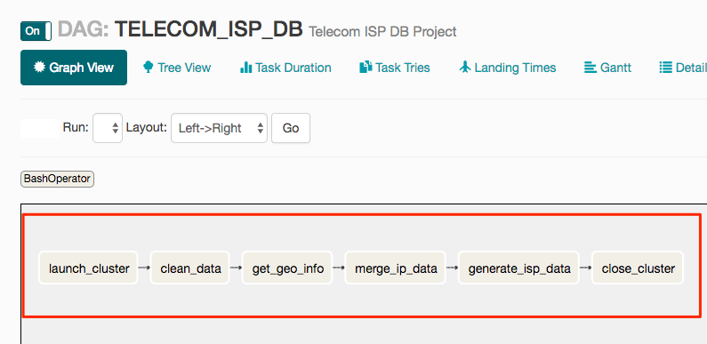

# Airflow #

由Airbnb所主導的Open Source專案，在2014年由**Maxime Beauchemin**發起，
在2015年對外發表，而在2016年6月正式成為apache孵化項目之一

## Purpose

**Airflow**主要是用來管理/監控任務的執行流程，藉由pipeline的方式來建立任務流程, 透過Directed Acyclic Graph(DAG)的方式來管理任務流程。

主要三個功能:

- DAG Scheduelr
- Web UI
- Powerful CLI


## Getting Started 
* [Install airflow](https://airflow.incubator.apache.org/installation.html)
* [Quick start](https://airflow.incubator.apache.org/start.html)
* [Tutorial](https://airflow.incubator.apache.org/tutorial.html)

## Principles
Airflow主要的四個重點：

* Dynamic
    - Pipelines are **configuration as code** 
    - Dynamic pipeline generation
    - Python 

* Extensible 
    - Easily define your own operators 
    - Executors for different environment

* Elegant
    - Pipelines are lean and explicit. 
    - [Jinja](http://jinja.pocoo.org/) templating engine to parameterizing your scripts 

* Scalable: 
    - Modular architecture 
    - Message queue to orchestrate an arbitrary number of workers.(CeleryExecutor)

## Concept 
#### Executor
1. SequentialExecutor : Only for demo/test
    * Support `Sqlite`
    * config setting `executor=SequentialExecutor`
2. LocalExecutor : For local production
    * Support `MySQL` / `Postgresql`
    * config setting `executor=LocalExecutor`
3. CeleryExecutor : For local/cluster production，設定上比較複雜
    * Support `MySQL` / `Postgresql` / `Redis`
    * config setting `executor=CeleryExecutor`
    * Rabbitmq

#### DAG
* 由一個或多個task组成
* 規劃tasks的相依關係
* dag_id



#### Operators
* Referred to as a Tasks
* task_id
* Common tasks:
    - BashOperator
    - PythonOperator
    - SqlOperator
    - EmailOperator
    - HTTPOperator
    - Sensor
    - SparkOperator will coming soon 
    - ...


**More info:**

- [https://airflow.incubator.apache.org/code.html#operators](https://airflow.incubator.apache.org/code.html#operators)
- [https://databricks.com/blog/2017/07/19/integrating-apache-airflow-with-databricks.html](https://databricks.com/blog/2017/07/19/integrating-apache-airflow-with-databricks.html)

#### Additional Functionality


底下介紹幾個有機會用到的功能：

* Hooks 
    - 建立與外部platforms/databases連接的功能，類似`JDBC Driver`一樣
    - aiflow提供多種hooks的訪問，例如：Hive,S3,MySQL,Postgres,HDFS,...etc
    
* Pools
    - 限制同時間slot的執行數量
    - 一個task就是一個slot
    - 指定task所屬的pool
    - 當所屬的pool可執行的slot數量已經佔滿時，其餘的slot就會處於等待狀態
    
* Connection
    - 設定訪問Databases所需要的參數設定，例如：host/port/username/password

* XComs
    - Tasks之間傳遞數值
    - xcom_push
    - xcom_pull
    - DAG參數設定`provide_context = True`
    
* Variables
    - 設定一些常用的變量
    - 可以針對不同環境(Prod/Dev)設定固定變量

* Branching
    - BranchPythonOperator
        - 依據上游的task所選擇的task_id來決定下游哪個分支要被執行 
        - 沒有被選擇到的task則會被skipped
    - ShortCircuitOperator
        - 依據True/False的結果，來決定是否的執行task
        - 如果上游task回傳為True，則下游task將會正常執行，反之則否

* SLAs
    - 設定預期Jobs執行所需的時間
    - 如果超過設定時間可以透過`sla_miss_callback`來設定`sla_alert_func`發出alert
      
```python
def sla_alert_func(dag, task_list, blocking_task_list, slas, blocking_tis):
    message = "{dag_name} SLA Miss for task `{task_list}`".format(**{
        'dag_name': dag.dag_id,
        'task_list': task_list})
    data = {'text': message,
            'channel': SLACK_CHANNEL,
            'username': SLACK_NAME}
    requests.post(url=SLACK_HOOK, data=json.dumps(data))
```    

* Trigger Rules
    - 所有的Operators都有`trigger_rule`的參數可以設定
    - Default value for `trigger_rule` is `all_success`
    - [Other rules](https://airflow.incubator.apache.org/concepts.html#trigger-rules)

## How airflow work?

#### Basic setting
```
-- airflow/
   |-- airflow.cfg
   |-- dags/
   |-- logs/
```
* dags: 要執行的DAG(python file)都放到這底下
* logs: airflow所產生的log file都會存放在底下

#### Workflow
1. Scheduler: 啟動後會主動掃描dags底下的python程式，確任每個DAG的排程時間
2. DAG: 當一個DAG啟動的時候，Airflow會在DB中創建DagRun的紀錄
    - DAG Runs: 表示DAG目前執行的狀態    
3. Task instance: 當一個task執行的時候，實際上是創建了一個task instance運行，來記錄task執行狀態
4. 當所有task執行完成後，會更新DAG Runs的最後狀態是`Success`or`Failed`

#### Airflow architecture

* Single Node

 Image source: [http://site.clairvoyantsoft.com/setting-apache-airflow-cluster/](http://site.clairvoyantsoft.com/setting-apache-airflow-cluster/)
 
* Multi Node

 Image source: [http://site.clairvoyantsoft.com/setting-apache-airflow-cluster/](http://site.clairvoyantsoft.com/setting-apache-airflow-cluster/)
 
* Scaling Master Nodes

 Image source: [http://site.clairvoyantsoft.com/setting-apache-airflow-cluster/](http://site.clairvoyantsoft.com/setting-apache-airflow-cluster/)

## Command Line Interface
介紹幾個比較常用的CLI:

* initdb: 在切換Database時都需要先初始化

```markdown
$ airflow initdb
```

* scheduler:啟動airflow scheduler
    -n NUM_RUNS: 退出scheduler前須執行的次數
    
```markdown
$ airflow scheduler 
```
 
* list_dags: 列出所有DAG

```markdown
$ airflow list_dags
```

* list_tasks: 列出某個DAG底下的所有tasks

```markdown
$ airflow list_tasks <dag_id> 
```

* test: 可以單獨測試DAG底下的task，用來測試task是否可以正常運作，是非常有用的一個指令

```markdown
$ airflow test <dag_id> <task_id> <date>
```

* backfill: 很重要的一個指令，主要是可以回朔執行某段時間的DAG

	使用場景:比如說某段時間的任務沒有啟動，需要重跑那段時間的任務

```markdown
$ airflow backfill <dag_id> <start_date> <end_date>
``` 

* trigger_dag: 直接觸發DAG，產生task instance，在scheduler被調用的時候，就會開始執行DAG

```markdown
$ airflow trigger_dag <dag_id>
``` 

* clear: 清空DAG的task instance

```markdown
$ airflow clear <dag_id>
``` 

## Tips

#### DAG arguments 
- `provide_context=True` 

	可以透過define function argument(<front style="color:#FF0000">**kwargs</front>)，使用`xcom_push`/`xcom_pull`來傳遞與擷取task之間的value。


- `depends_on_past=False`

	如果設置為`True`，DAG執行會參考前一次DAG的執行狀態，如果前一次執行的狀態為`Failed`，那就不會執行。
	
	在設定這個參數前請先想清楚整個任務的執行流程與使用情境。
    
- `dagrun_timeout`
    
     此參數用來設定在DAG Run結束之前，所執行的時間，與sla的設定有異曲同工之妙，
     但最大的差異是，如果<front style="font-size:100%;color:#FF0000">time out</front>，DAG的狀態就會直接變成<front style="font-size:100%;color:#FF0000">**Failed**</front>，
     而不像sla可以設定callback function。         

## Reference
##### Document & gitHub 
1. [https://airflow.incubator.apache.org/index.html](https://airflow.incubator.apache.org/index.html)
2. [https://github.com/apache/incubator-airflow](https://github.com/apache/incubator-airflow)

#### Introduce
1. [http://www.cnblogs.com/harrychinese/p/airflow.html](http://www.cnblogs.com/harrychinese/p/airflow.html)
2. [https://www.slideshare.net/r39132/introduction-to-apache-airflow-data-day-seattle-2016](https://www.slideshare.net/r39132/introduction-to-apache-airflow-data-day-seattle-2016)

#### Tutorial
1. [http://michal.karzynski.pl/blog/2017/03/19/developing-workflows-with-apache-airflow/](http://michal.karzynski.pl/blog/2017/03/19/developing-workflows-with-apache-airflow/)
2. [http://blog.genesino.com/2016/05/airflow/#%E9%85%8D%E7%BD%AE-mysql%E4%BB%A5%E5%90%AF%E7%94%A8localexecutor%E5%92%8Cceleryexecutor](http://blog.genesino.com/2016/05/airflow/#%E9%85%8D%E7%BD%AE-mysql%E4%BB%A5%E5%90%AF%E7%94%A8localexecutor%E5%92%8Cceleryexecutor)
3. [http://site.clairvoyantsoft.com/setting-apache-airflow-cluster/](http://site.clairvoyantsoft.com/setting-apache-airflow-cluster/)
